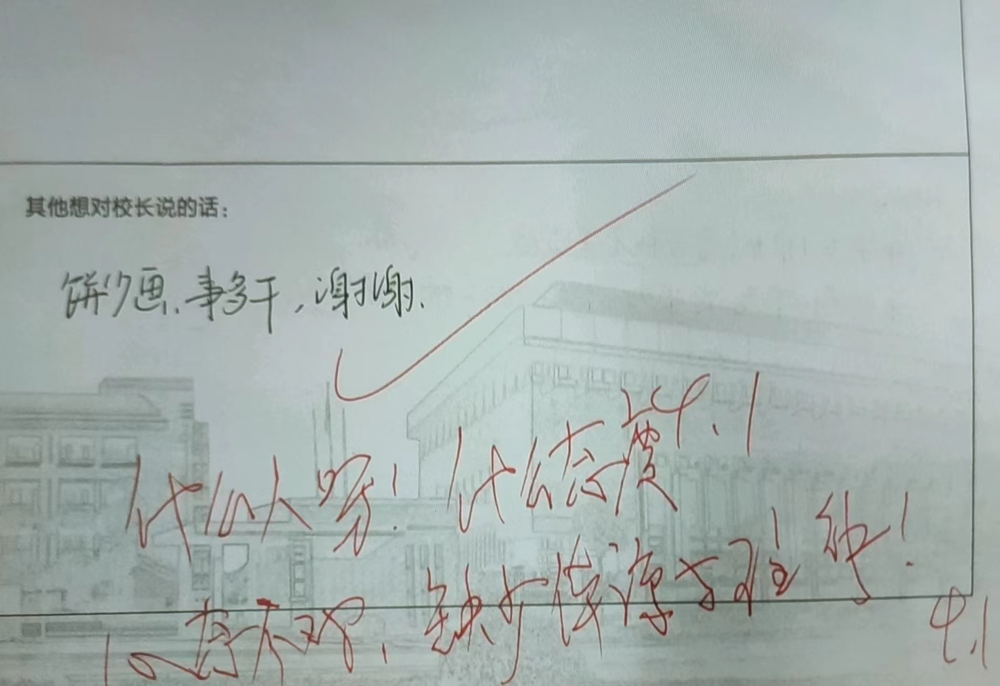
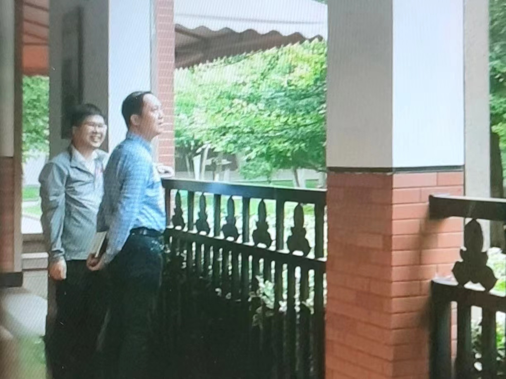

# 二中永業抄——Imperishable Homework
* 笔者/山川

2024年的一个夜晚，二中爆发作业异变，所有学科的作业量都发生了指数级增长。作为402班的守护者，你被派往调查异变的源头，打败9位boss，寻找被隐藏的真相。

请在晚自修结束前上交《优化设计》以开始游戏。

## Stage 1
>　19:00 钱宁楼一楼

为了解决作业异变，你来到了二中的化学实验室。正当你穿行在走廊之中时，一个披着披风的黄色身影冲了过来……

>　一面boss：
小小的化学上帝——奶龙

龙："这位同学，请你写一下十六烷基三甲基溴化铵燃烧的热化学方程式。”

“这么难的化学作业真的有人能做出来吗（^^ ;）”

龙：“这道题呢是学考范围内的，所以呢应该是所有同学都要求掌握的”

“老师，今天都没有化学课，怎么能有化学作业呢”

龙：“是——这样吗？那么现在，上  ！课  ！”

请在下次上课前写完专题提升卷（八）以打败奶龙，开启Stage 2

## Stage 2
>　19:30 鹤琴八院

打败了化学老师之后，你打算前往生物实验室进行调查。行进途中，不断有红眼与白眼的昆虫向你袭击。

“最近的虫子真是越来越烦人了呢”

？？？：“我不同意你的看法”

（生物老师一脸和善地走了过来）

>　二面boss：
蠢蠢欲动的夜之虫——叶格露·奈特巴格[^1]

叶：“果蝇可是我们做生物实验的好朋友，做成标本也很可爱呢:3”

“难道最近有什么生物实验吗？”

叶：“有一个，是探究高中生在猝死前能写多少作业的实验”

“那我可得多带些杀虫剂，反正这次实验不需要果蝇\^w^”

叶：“（失去高光）你要是这么干的话，我只能让你抱着遗憾 回 归 无 机 世 界 了”

请完成《优化设计》3.2工业区位因素以打败叶格露，消灭虫子军团，开启Stage 3

## Stage 3
>　20:00 竺可祯长廊

击败生物老师后，你来到了长廊。长廊边本该有个小湖的地方，现在却什么都没有了。

？？？：“（呼~）同学们准备一下小听写，准备一下新概念，准备一下最新一期的英语报纸”（英语老师瞬移到了你面前）

>　三面boss：
紫色的魔法使——斯宾塞·斯卡蕾特[^2]

“这里本应该是碎心湖吧？现在却什么也没有了。你们对碎心湖做了什么”

Spc：“没做什么。我们英语组只不过是利用了英语古籍上的魔咒，封印了校园中除学习以外的存在”

“解除封印的方法是什么？”

Spc：“当然是小听写啦~这次的小听写呢主要都是句子，大家要好好准备一下”

“这种东西错三四个都没关系的吧（^^ ;”

Spc：“错两个以上就要被留观哦~”

请在地理课前完成第三章测评，打败斯宾塞，击破封印结界，进入Stage 4

## Stage 4
>　20:30 碎心湖

你用了三张「免小听写券」击碎了英语老师的结界。碎心湖、二中之巅、国际部等景象重现人间。然而你察觉到似乎有些异样——湖边开满了红色的鲜花

“这么热闹，看来都很有空嘛，要不要再布置点（乛v乛）”

>　四面boss：
令人怀念的东北之血——独孤凡羽

“这些罂粟是你种的吗？”

羽：“怎么了？这种东西不应该每个人家里都种的吗？”

“你这是违法行为。走，跟我去自首”

羽：“你是脑子锈掉了吗？真是少见多怪。倒是你们，一天天的语文作业都不做，你们是想起飞↑吗？”

请尽早完成《学考知识整理》59-60页与《学考真题汇编》196-200页，打败独孤凡羽的阴谋，进入Stage 5

## Stage 5
>　21:00 行政楼

打败语文老师后，她免去了你的语文作业。你四处观望，发现了结界内的妖气聚集在了二中之巅。顺着楼梯来到了二中之巅的门口，却你发现大门被一张卷子所封印。凑近一看，卷子上赫然写着几个大字：

杭州二中高一下数学测试

“有种不详的预感……”

？？？：“醒醒！！”

（背后传来一声巨响，你回头一看，数学老师正盯着你）

CAUTION!!!!!!!CAUTION!!!!!!!!

>　五面boss：
不可谈论的怪力乱神——可赛因·叶卡捷琳娜

可：“快让课代表把卷子发掉，今天九点半到十一点年级统一数学考试”

“这么晚考试绝对会睡着的呀（^^ ；”

可：“怎么可能？你想想看，你想睡觉的时候别人不是也想睡觉？人家学车现在要写作业写到十二点，你想想你们有多幸福？”

“这个人真是太危险了，必须尽快解决掉”

可：“话说你们班交作业真是不积极，10班作业都批完了你们2班作业还没抱过来”

（窗外顿时间下起倾盆大雨，天空变成血红色）

可（红眼）：“不交作业的人，就应该在数学的地狱中被试卷压成废肉！”

（看来这是一场苦战了）

请大家认真完成学高知识整理P61与试题汇编P201-204以打败可赛因。通过Stage 5后即可见到异变的主犯。

## Extra Stage（民间版本-zyh）
> 21:20 国际部食堂

为了尽快打败可赛因，你决定先前往食堂吃点宵夜补充能量。昔日人满为患的国际部食堂此时已因作业异变而显得空空荡荡。你飞奔着冲向窗口。

？？：“哇塞~年轻就是好，吃个夜宵也跑这么快”

> 5.5面boss:
劝人学文三大幻神之首——黄怀王

“跑饭不快点怎么准备考试？”

黄：“考试有什么好紧张的啦，小考小玩，大考大玩嘛”

“那高考不就玩完了……”

黄（坏笑）：“答（dā）：不一定嘿嘿嘿~”

“什么不一定，我看是一定吧⊇△⊆”

黄（笑容消失）：“那你们才交那么点历史作业！！你们是想成为得E门生还是得D高僧~”

“还不是都怪你上课讲的都不考，就记得东扯西扯”

黄：“我这叫形散神不散，谁叫你们就记点不考的东西。”

（缓缓脱下帽子，三颗光球缓缓升起，环绕着你）

黄：“先找个人把上节课讲的东西附属一遍，就你吧”

（看来这仗不好打啊）

请大家抓紧完成全部地理作业和数学作业以打败历史老师，前往Stage 6A。

## Stage 6A
>　21:30 二中之巅

打败了恐怖的数学老师后，天空恢复了正常，大门上的封印也随即解开。大门之后，是一个身高一米吧的清秀男子。一个大魔法阵在男子的背后发出微弱的莹光，玻璃上的文字显得格外黯淡。

“原来，你就是异变的元凶吗，敬爱的班主任”

>　六面boss:
秒表中的未来宇宙——征宇魔理沙[^3]

宇：“我只是今晚来值班的，连晚饭都还没吃呢~”

“你的意思是说异变不是你发动的？”

宇：“既然你这么问了，那我就简单说两句——我们物理组一起秘密修改了某个物理定律，让作业与时间成指数函数关系增长。这就是你们写不完作业的真正原因”

“你们的目的是什么？”

宇：“我们所做的一切，都是为了延长宇宙的寿命。人类从希望堕入绝望的过程会产生巨大的能量，而这种情感波动在写作业的学生中最为明显。只要你们产生足够的绝望，便可逆转熵增，让宇宙达到永生。”

“你们老师果真是抖S虐待狂啊”

宇：“哎~这可不能怪咱们。这是兄弟学校先搞起来的，我们学校当然不能落下。再说校领导的命令我们怎么能违抗呢？”

“我们对献身于宇宙没有兴趣，快让这一切停止”

宇（冷笑）：“你是想挑战你眼前的物竞之王吗？嘁~你们这些连计算都算不清的渣滓，我一眼就能秒掉十个！”

请大家抓紧完成两张地理卷子并在平板上提交，对完答案后明天上交纸质版，以打败邪恶的物理老师，让二中摆脱作业的诅咒。

经过艰苦的战斗，你终于打败了物理老师，破坏了修改物理定律的法阵。

然而，作业的异变仍未结束。第二天，作业仍以不可思议的数量布置了下来。光是数学作业中的五三就能做一整个晚自休。

同时，你发现最近物理老师经常出现在地理办公室中。种种异常让你意识到了什么……

在整场异变中，物理组负责修改定律，生物组负责人体实验，英语组负责布置结界，数学组负责剿杀结界内的学生……地理组是否也承担了什么秘密任务？

征宇魔理沙，威严满满的大小姐，高高在上的婆罗门，他究竟还隐瞒了什么？

请各位完成地理学高4.3海洋权益以及5.1环境问题相关内容，进入B路线，挑战真正的最终boss

## Stage 6B
> 22:00 箴华音乐厅

本该空无一人的箴华音乐厅，里面却传来了美国民谣的音乐声。你推开大门，看见一个拿着吉他的帅气男子。

？？：“oi，竟然是你小子，太坏了嗷”

> 六面boss:
吉他与遥感与幽默星球——十六夜猫玮[^4]

“所以这究竟是怎么回事？”

玮：“事情呢是这样的：学校为了防止学生破坏计划，创造了两个物理法阵。二中之巅的法阵不过是我们运用遥感创造出的幻象，真正的法阵在这里被我们地理组所看守”

“所以只要打倒你就行了吧？”

玮：“你说的对，但是你是无法打败我的！你所见到的箴华音乐厅，也只不过是我用遥感作出的结界。结界内的气候、地形、昼夜甚至地球自转角速度都由我来控制！我将这一招命名为「图寻幻影」。唉呀~我真是太幽默了……”

（此时，一个熟悉的身影进入了音乐厅）

活泼纯情的跳跳糖——征宇魔理沙

宇：“听说这里有初音〇〇的演唱会，所以我就过来了”

玮：“那是我瞎编的，就是想叫你过来帮忙，果然只有你被骗了”

宇（厌恶）：“嘁，想要惹我发火是不是？鬼畜！变肽！渣滓！”

玮：“可爱捏~”

宇：“太逆天了！八噶，很太，无路赛！”

“你们两个把氛围都破坏了喂（^^ ；”

玮：“那么，幽默就到此为止了……”

（地理老师高举右手，背景切换至南京大学）

玮：“二中的学生，在文与理的地狱间挣扎吧！”

请各位同学完成学高作业本p215-223，打败十六夜猫玮与征宇魔理沙，让二中迎来真正的曙光

## Good Ending

二中的作业量终于恢复了正常，为了纪念这历史性的一刻，各班自行举办了庆祝活动。

宇：“哎呀~没想到搞了那么久的物竞还是没能战胜一个学生，头发倒是掉了不少”

玮：“没事的，你头发再少也会找到女朋友的”

宇（嫌弃）：“切，不要把你和我相提并论”

主角：“要是每天都能像这样玩就好了啊，毕竟这样的日子还得过三年呢”

玮：“话说回来，作业异变的计划失败的话，宇宙岂不是就无法达到永生了？”

宇：“确实是这样。没有了减熵的过程，宇宙终有一天会达到终结。不过嘛……”

玮：“哎呀！这是我的泡面！”

宇（吃泡面）：“……正是因为时间是有限的，当下才会显得格外重要呢。一分也好，一秒也罢，只要是和大家度过的每个瞬间，都能成为珍贵的「永远」哦”

恭喜您已达成Good Ending.如果你想知道剩下两个老师在哪里的话，请于本周完成学高真题汇编与知识整理的第一章【宇宙中的地球】相关内容，开启Extra Stage

## Extra Stage（民间版本-dyz）
> 24:01 碎心湖

由于你在抱作业去往十六夜办公室的时候非要绕道碎心湖（？），湖里的鲤鱼精饿得发疯就把作业本里的墨水吃了。表面上整整齐齐的41本地理作业，内里已经只剩下了笔尖留下的压痕和同学们奋力抗争的痕迹。地理作业在法阵上铺排开的影样只是十六夜的遥感幻境、真正能毁掉法阵的字迹已经消失不见，十六夜将计就计的谣咸与吉他麻醉了你的心智。歌舞升平的二中里没有人知道这是幻象你也只和他们一起狂欢，直到……

十六夜："Please bring me my (home)work~"

对小旅馆[^5]的熟识让你立刻惊觉，似乎十六夜的话里藏着未见光的密语。

"Wake you up at the middle of the night, just to hear them say~"

你无心欣赏十六夜的甜美歌声，逃出教室，来到碎心湖，期待平静的湖水能给你一个答案。

？？：“作业么不写就不写了，投湖干什么”

> 历史真相的隐瞒者：
光球层耀斑

球：“李副使上次送给我的帽子被我掉湖里了”

“历史的真相是不是也被你掉湖里了？”

球\*坏笑*：“嘿嘿嘿....”（笑容消失）“我跟你讲，dā：不yī定！”“什么不一定，我看是一定吧⊙_⊙”

“那你下去捞吧！”（恶狠狠）

说罢，光球层用踢了几十年足球的健壮腿脚把你踢下春游桥，耀斑闪耀在你眼前，鲤鱼精嘴里的文字闪闪发光。

……

欲知后事如何，请写地理作业。

* 帽子实际情况不明，此为剧情需要，请勿当真。

* 感谢副使友情客串。

## Parallel Stage（unoffical-xsz）
> 21:50 南教学楼4楼

作业风波算是过去了，你站在楼顶俯视校前广场吹着夜风。MW，ZY，Yekaterina，GOC，Yeglu，Spc…一个个人影在脑中浮现，这些危机的制造者终于落网，但是，好像少了什么…

是动机！你灵光乍现，如果只是为了折磨学生，这样的动机也太恶趣味了！一定有什么是我们遗漏了的…

想到这里，你动身拿上了刚写好的地理作业本去了地理组办公室。你隐约觉得，一场掀起二中的风暴，才刚刚开始。

玮：“你果然来了，大英雄。你是来嘲笑我的失败，还是想要遥感与旅馆？”

你：“不要再隐瞒了，你其实不是幕后黑手，是吧？”

玮哂之。“球！尔何如？”

你微微一笑，“果然是你，历史真相的埋没者——答·球”

一个身影从角落里走出来，“哦，你是怎么知道的？”

“二中的作业自古以来都很多，而这些都是新来不久的老师出面，因此我想，有一个更老的主使。”

“但是我要告诉你，答：不一定。”

“不要再装了。你这么老的老师，却在省教坛新秀上展露历史的真相，那么你之前干什么去了呢？”

“哼，是又怎么样？就凭你还能打败我正驶Yellow Haveball？”

你掏出地理作业本，向十六夜投去信任的目光，“那就试试看吧！”

## Extra Stage
> 20:00 平流层

作业异变结束后，时生天文社在二中上空441千米处观察到了发光不明飞行物，可能对校园构成威胁。为了保护校园的安全，技术老师制造了飞行战甲，派你去太空中一探究竟。

然而，在海拔10千米处，你受到了一栋建筑物的阻拦。那是一座飞在空中的上海石库门建筑，门上写着四个大字：“逍遥学堂”[^6]

> Ex道中boss:
比赤色更红的梦——逍遥子

逍：“同学，你的作业怎么没有写呢？不应该的哦”

“欠作业的是昨天的我而非今天的我，你要找的话就找昨天的我吧”

逍：“啊？↑↓那我可要作为暴力机关对你行使专政了哦”

“唉？中国特色社会主义的好老师可不能体罚学生呀”

逍：“反正惩罚你的也只是现在的我，未来的我可是无罪的哦”

请大家完成地理模拟试卷（4），击败逍遥子，探究被隐瞒的「历史的真相」

## Extra Stage（民间版本-dyz）

> 6:30 荒废的，鹤琴书院的背面

危急时刻，你抓到了副使送给光球层的帽子。一顿交涉后你成功用帽子和鲤鱼精完成交易，换回了质量微小却可以释放巨大能量击碎法阵的字迹。为避免鲤鱼精反悔，你快速离开了小湖，想到图书馆借一本普通地质学平复一下心情，顺便等风把自己吹干。夜风清润而平缓，喇叭也不再说着“警戒区域尽快离开“这极具梦核色彩的话语，蝉鸣声声，虫吟阵阵，普通地质学盖在你脸上，你安静地睡着在这里，直到次日清晨被温柔的黎明和原野的鸟唤醒。黎明的美丽颜色照进你的眼睛，你不由得想起自己对大气散射的知识已经生疏了。手持击碎阴谋的光芒和心存对地理完全出乎爱与真诚的敬重，去往十六夜办公室的路上你又一次被拦住了。

？？？：“同学们，你们的作业↑写了吗？”

> final but unofficial boss：
红星青苗——Cu~2~O逍遥

窈：“***，你这次的作业怎么也没有完成呢？不应该呀，你一贯学习蛮认真的。要将功补过，这次由你在课前把补交的政治作业收齐交给课代表哦~”

“这种东西写了真的有用吗0n0”

窈：“写一课市统测加5分，从60分开始算哦”

“反正我也不选，60分就行了吧\*=\*”

“啊↓↑？我们杭爱中的同学，上次考试还说自己作为新时代青年不会辜负中国特色社会主义，现在连作业都不写了？”

你嗅到了危险的气息，一点点向鹤琴书院挪移。然而你并不知道，背后的团支书已经被指数增长的作业逼得形成了作业依赖，你逃出了逍遥的视野却被刚刚从青苗班下课的团支书叉了回来。与此同时，课代表也拿着酸奶从大麦部出来，对你和你的普通地质学形成了三驱为度，而你却因没写作业而走投无路。

“是的，我知道,我知道我的针织作业没有写！

“但是大行不顾细谨，大礼不辞小让，我相信你们都清楚，我的针织作业没写和作业异变不能尽快解决，孰轻孰重！

“我是为民请愿的人，我是爱与真诚，不要阻挡事物永恒的发展，二中的回归是历史的必然！

“我的同志们会完成[占位符：广告位招租]为人民的利益和永恒的热爱，输入破除法阵最后的负熵流，让真理的力量统治这个世界，就像，就像本应如此的那样！”

* 感谢团支书和课代表友情客串，文字仅为剧情需要，不指实际情形。
* 民间版本，请勿当真。

## Extra Stage
（出于特殊原因，本文禁止转载）
> 20:30 东方红一号卫星近地点

你打败了政治老师，来到了旅途的终点。一个五十多岁的男人盘腿坐在宇宙间，他的帽子当中溢出道道金光。

？？？：”唉唷，你总算来了，我等你等了一节课啦~”

> Extra boss:
今宵是飘逸的无所谓主义者——怀球

球：“好了，上节课我们上到哪里了？”

“等等！你先回答我你在这里干什么？”

球：“哼~几个月前行政组公布了作业异变的计划，我带头反对，与他们发生了战斗”

“那你后来赢了吗？”

球：“最终我寡不敌众，被他们封印在了碎心湖”

“怪不得碎心湖会有语文老师和罂粟，原来是为了镇压”

球：“语文这门学科就是草菅人命！当年我就是因为语文作文高考失利才学历史专业的！”

“所以你是怎么解除封印的？”

球：“这得多亏了你啊，就是你打败了语文老师我才会被放出来的”

球：“逃出生天后，我已经对教育界彻底失望，于是来到此地，悟道成仙，化入光明顶之境界。接下来，我完成对应试教育的复仇……”

“难道你要发动起义吗？”

球：“二中是时候需要一场「大变」了！我就是要把上面的人拽下来，把下面的人抬上去！”

“明明是特级教师，思想怎会如此激进”

球：“攻占二中只是我的第一步，接下来我要对整个教育界宣战！”

“没有人会认同你的思想的，又黄又ball的邪仙！”

球：“我就是要告诉你们这些内心阴暗，面露蔡色的年轻人，学习追求的是知识和兴趣，而不该纯粹异化为成绩和敲门砖！”

（怀球动用仙术，把九个帽子附上了历史人物的灵魂）

球：“不共戴天之敌！小熊啊，你看到了吗？学生在应试教育中挣扎的样子！”

请大家于两周内完成学高作业本p118-130与小蓝p37-49，平定怀球的叛乱，救母校于水深火热之中

## Extra Ending
经过艰苦的战斗，你终于打败了历史的邪仙。高级教师叛变的消息轰动了全国，教育界一时间人人自危。为了防止自己的学校遭遇灭顶之灾，各大高校从此再也不敢胡作非为。

叛变的发动者本人则已下落不明，他在战斗中隐藏了自己的真正实力。据说他将一半的神力传给了一位名为「副史」的神秘人，随时准备着对教育制度发动下一场革命...

恭喜你达成了Extra Ending["God" bless you]，本游戏已通关，感谢您的游玩。请完成学高作业本至223页，即可于地球Online解锁毛老师准备的特殊彩蛋。

特别鸣谢：

DYZ XSZ ZYH LYZ 为本游戏进行的二次创作

ZZY MW 为本游戏的授权

以及

每一位热爱地理，坚持到最后的玩家们

感谢大家对本游戏的支持

## The Ending 四维碎块（民间版本-lyz）
解决掉怀球后，你独自驾驶机甲向外太空飞去。从你眼前掠过是太空尘埃，是光正以3×10^8^m/s的速度去向未知的地方，是时间匆匆来又匆匆去，不留痕迹。你从机甲的舷窗回望向地球，美丽的蓝星、此刻正闪耀着她无与伦比的生命力。

刹那间，你的机甲数据显示一片空白，低头看向自己的手，机甲覆盖下的手血管清晰可见，骨骼分明。直觉告诉你，你进入了四维碎块。你感到从未有过的恐惧和兴奋，想起身上背负着的重任，你驾驶机甲继续往深处飞去。

随着你的继续深入，一种无法抗拒的无力感蔓延你的全身。突然一个黑色的大环映入你的眼帘。

你注视这个黑色的大环，一种撕扯感向你袭来，仿佛世间万物都要被它强大的吸引力所湮灭。你继续靠近这个大环，端详着其表面覆盖着的奇怪纹路。

“你还是来了”一个庄严而肃穆的声音响起。

这是？蔡校。

出现了，最后的决战——永恒之下最后的比蒙。

“你为何来此？”

“这是我要问你的问题，二中作业异变即将结束，可是自始至终，我们最敬爱的校长都没出现过，你不觉得这很奇怪吗？”

{:width='500' align='right'}
{:width='500' align='right'}
{:width='500' align='right'}

“哈哈哈哈哈哈，好小子，还记得我，那一刻我忍不住热泪盈眶，进来吧，伸手触摸这大环，触摸这永恒的深渊。”

恐惧和不安占据了我的心，你稳定机甲，伸出冰冷的机械手臂，触摸了环。

手指与环接触的那一刻，你感受到前所未有的吸扯力，仿佛光也无法逃脱，像是一种宇宙法则。你的脑海中掠过童年的快乐时光、无忧无虑的小学、略有疲惫的初中，想起爸爸妈妈的脸，想起朋友们的笑容，眼前的一幕幕如过往云烟，最终画面定格在二中的教室。

“这就是你想要的吗，蔡校，学生在作业的水深火热中挣扎。”

“你这是什么话，什么人啊什么态度，缺乏体谅与理解，孩子，要多想。”

“该结束这一切了，给我一本高妙，清理用。”

你向着环的深处，用尽全力，掷出了那本高妙，降维开始了，环开始崩塌。你看着小熊惆怅的侧脸，那是一幅世间最伟大的画作。

“孩子们，快逃啊！”那是怀球的声音！

“球爷！！！”

怀球用尽最后的法力，将你送出了四维碎块。

宇宙重归寂静，最后留下的，只不过是一张画而已。百年后。一支太空科考队发现了画，那是一块墓碑，埋葬着应试教育，埋葬着人类最不羁的灵魂。

智慧永远指向虚无之境，我们的路究竟在何方？

答：不一定。

[^1]:莉格露·奈特巴格是东方Project系列中的官方角色，首次登场于东方永夜抄，担任永夜抄的一面Boss。她是萤火虫妖怪，身边总会围绕着很多虫子。

[^2]:芙兰朵露·斯卡蕾特是东方Project系列中的官方角色，吸血鬼，拥有破坏一切程度的能力，于东方红魔乡中首次登场。
[^3]:雾雨魔理沙，系列作品东方Project中的主人公，居住在魔法森林的人类魔法使。作为人类使用着魔法，像是和灵梦竞争一样进行着退治妖怪活动。居住在远离人类村里的魔法森林里，经营着名为“雾雨魔法店”的万事屋。
[^4]:十六夜咲夜，东方Project系列弹幕游戏及其衍生作品的登场角色之一，红魔馆中的唯一人类，担任着女仆长一职。持有对人类而言最高级的能力：操纵时间程度的能力。会变魔术，使用飞刀作为弹幕，投掷飞刀的技术相当厉害。
[^5]:指*Hotel California*。其中歌词有"Please bring me my wine" "There were voices down the corridor, I thought I heard them say"句。
[^6]:陈枭窈老师为她的云课堂取的名字。