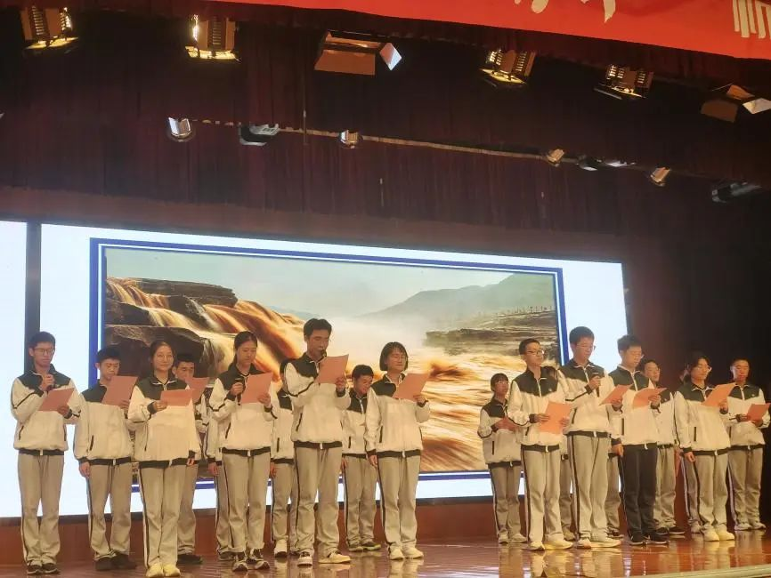

# 诗歌朗诵

* 笔者/张逸涵

{:width='500' align='right'}

若不计体育赛事的话，朗诵比赛应该是402班经历的第一个大型集体项目。与现在学海平板上每天动辄几十上百条消息的时光相比，那简直是远古时期。那时候连班群都尚未建立、几乎无资料记载，所以我只能通过脑海中残存的回忆，勾勒出这件事的全貌。

与之后的合唱和配音比赛相比，那次的诗歌朗诵比赛可谓是草草开场，潦草收尾。我们只有一个月左右的时间进行选诗和排练。因为那时平板通讯还不及现在那么发达，我们在选诗上反而省去了大众点评的环节，十分迅速地选定了杨子霖同学提议的《祖国，或以梦为马》并由他和凡羽姐进行主要策划安排。受班主任朱征宇老师的道家思想影响，我们的重点放在了临近的大考上，彩排较为草率，与后面相比可以说是毫无准备：彩排次数不多；朗诵人数太多；无法脱稿；临时打印的稿件简陋；与六班的诗歌重合，对比产生伤害；动作服装设计不足……这些不利条件都为我们的失利埋下了伏笔。

尽管如此，这次诗歌朗诵在班级历史上仍占据着极为重要的历史地位。因为它见证了402班从满天星聚成一团火的巨大蜕变，开启了之后我们二班人团结一心、奋勇拼搏、互帮互助的美好时光。当时的我们满怀信心与一腔热忱，以极为乐观的态度积极地投入这次活动。无论结果如何，它都注定是每个402成员高一生活中美好的回忆。

* 笔者/林奕希

朗诵比赛中，每位同学都以饱满的情感、激昂的声音诵读诗歌。台下一次次的排练，逐个亮起的聚光灯，层层递进的诵读，观众席雷动的掌声，都充分展现出同学们对比赛的热情。伴随着渐强的音乐，我从震撼人心的声音中体悟到同学们对于青春的热血沸腾，对于祖国的无限热情。青春的铮铮誓言，是对盛世华章最好的回答。祖国，或以梦为马。